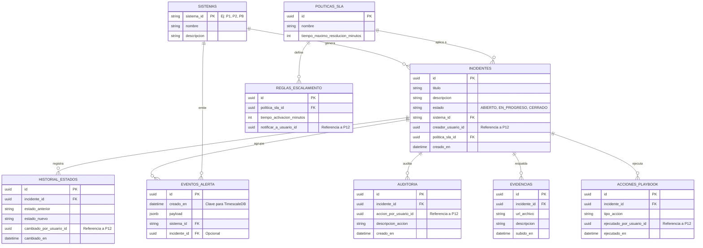

# Proyecto 11 
Monorepo con:
- Frontend: Next.js + TypeScript
- Backend: NestJS + TypeScript
- Base de datos: PostgreSQL
- Cache: Redis
- ORM: TypeORM
- Contenedores: Docker Compose

## Estructura

```txt
apps/
  frontend/
  backend/
docker-compose.yml
package.json
```

## Requisitos

- Node.js 20+
- npm 10+
- Docker Desktop

## Configuracion inicial

1. Instala dependencias del monorepo:

```bash
npm install
```

3. Levanta servicios de infraestructura:

```bash
docker compose up -d
```

## Desarrollo

Ejecuta backend y frontend en dos terminales:

```bash
npm run dev:backend
```

```bash
npm run dev:frontend
```

- Frontend: http://localhost:3000
- API Health: http://localhost:3001/api/health

## Build

```bash
npm run build
```

## Diagrama Entidad-Relación (Base de Datos)



## 📚 Referencia de la API

Todas las peticiones deben dirigirse a la ruta base `/api` (ej. `http://localhost:3001/api`).

### 1. Operaciones (DevOps / Infraestructura)
Verifica el estado de salud del backend y sus conexiones internas. Ideal para los *Healthchecks* de Docker.

**Endpoint:** `GET /health`

**Respuestas Esperadas:**
- ✅ **200 OK:** El sistema está operativo y conectado a la BD/Redis.
- ❌ **503 Service Unavailable:** Falla en la conexión a la infraestructura subyacente.

---

### 2. Ingesta (Sistemas Externos: P1, P2, P8)
El sistema utiliza Redis para encolar alertas masivas de forma asíncrona, protegiendo la base de datos principal. Los sistemas externos deben utilizar este endpoint para reportar incidentes.

**Endpoint:** `POST /ingestion/alertas`

**Headers Requeridos:**
- `Content-Type: application/json`
- `x-api-key: <LLAVE_SECRETA_DEL_SISTEMA>` *(ZeroTrustGuard validará estrictamente que la llave corresponda al sistema emisor).*

#### Estructura del Payload (Request)
El sistema emisor debe enviar un JSON con la siguiente estructura estricta:

```json
{
  "sistema_id": "P8", 
  "payload": {
    "sensor_id": "termometro-bodega-norte",
    "temperatura": 85.5,
    "estado": "critico"
    // Cualquier dato adicional estructurado (JSON válido)
  }
}
```
*Nota: Cualquier campo fuera de `sistema_id` y `payload` en el nivel raíz será rechazado automáticamente por el servidor (Error 400).*

**Respuestas Esperadas:**
- ✅ **202 Accepted:** La alerta fue recibida y encolada exitosamente.
- ❌ **400 Bad Request:** Faltan campos obligatorios o se enviaron campos no permitidos.
- ❌ **401 Unauthorized:** No se proporcionó API Key o las credenciales no coinciden con el `sistema_id`.
- ❌ **500 Internal Server Error:** Falla en la infraestructura de encolado (Redis inactivo).

---

### 3. Incidentes (Frontend UI)
Obtiene la lista de incidentes persistidos en PostgreSQL. Este endpoint retorna meta-información matemática para facilitar la renderización de tablas y la paginación en la interfaz de usuario.

**Endpoint:** `GET /incidentes`

#### Parámetros de Consulta (Query Params - Opcionales)
| Parámetro | Tipo | Default | Descripción |
| :--- | :--- | :--- | :--- |
| `page` | `number` | `1` | Página actual de resultados. |
| `limit` | `number` | `10` | Cantidad de registros por página. |
| `estado` | `string` | `null` | Filtrar por estado (`ABIERTO`, `EN_PROGRESO`, `CERRADO`). |
| `sistema_id` | `string` | `null` | Filtrar por el sistema de origen (ej. `P8`, `P1`). |
| `orden` | `string` | `DESC` | Ordenamiento por fecha de creación (`ASC` o `DESC`). |

#### Ejemplo de Petición
`GET /incidentes?page=1&limit=5&estado=ABIERTO&orden=DESC`

#### Respuesta Exitosa (200 OK)
```json
{
  "data": [
    {
      "id": "e8a2a0a2-2b3a-4a6c-9b1b-7c1a8e1a9b2b",
      "titulo": "[P8] Alerta automática — 2026-05-26T20:33:29.839Z",
      "descripcion": "Payload inicial: {\"sensor_id\":\"termometro-bodega-norte\",\"temperatura\":95.5}",
      "estado": "ABIERTO",
      "sistemaId": "P8",
      "creadorUsuarioId": "00000000-0000-0000-0000-000000000001",
      "politicaSlaId": "11111111-1111-1111-1111-111111111111",
      "creadoEn": "2026-05-26T20:33:29.834Z"
    }
  ],
  "meta": {
    "total_registros": 42,
    "pagina_actual": 1,
    "total_paginas": 9,
    "registros_por_pagina": 5
  }
}
```

## ⚙️ Worker de Procesamiento Asíncrono

Una vez que la alerta es encolada en Redis, el **Worker** la desencola automáticamente y la persiste en PostgreSQL. Este componente corre dentro del mismo proceso NestJS como un consumidor BullMQ.

### Flujo completo

```
POST /ingestion/alertas
  → ZeroTrustGuard valida x-api-key
    → IngestionService encola job en Redis (alertas-queue)
      → AlertasProcessor desencola automáticamente
        → WorkerService.procesarAlerta()
          → Transacción: INSERT incidente + INSERT evento_alerta en PostgreSQL
```

### Archivos del Worker

| Archivo | Responsabilidad |
|---|---|
| `src/worker/worker.processor.ts` | Consumidor BullMQ — escucha `alertas-queue` y recibe cada job |
| `src/worker/worker.service.ts` | Lógica de negocio — valida datos y ejecuta la transacción en PostgreSQL |
| `src/worker/worker.module.ts` | Módulo NestJS — registra la cola, entidades y proveedores |
| `src/database/entities/sistema.entity.ts` | Entidad TypeORM para la tabla `sistemas` |
| `src/database/entities/politica-sla.entity.ts` | Entidad TypeORM para la tabla `politicas_sla` |
| `src/database/entities/incidente.entity.ts` | Entidad TypeORM para la tabla `incidentes` |

### Pasos internos de `WorkerService.procesarAlerta()`

1. **Validar sistema** — Busca el `sistema_id` en la tabla `sistemas`. Si no existe, lanza un error y BullMQ reintenta el job (máx. 3 veces).
2. **Buscar política SLA** — Obtiene la política SLA por defecto (la de menor tiempo de resolución).
3. **Transacción atómica** — Abre un `QueryRunner` y ejecuta en una sola transacción:
   - `INSERT` en `incidentes` vía repositorio TypeORM (título generado automáticamente como `[P1] Alerta automática — {timestamp}`)
   - `INSERT` en `eventos_alerta` vía **SQL raw** (requerido por el hypertable de TimescaleDB con clave primaria compuesta `id + creado_en`)
4. **Rollback automático** — Si cualquier INSERT falla, ambas operaciones se revierten y el error se relanza para que BullMQ reintente.

### Nota sobre `creador_usuario_id`

Los incidentes generados automáticamente usan el UUID centinela `00000000-0000-0000-0000-000000000001` como actor sistema. Este valor debe ser reemplazado por el `JWT.sub` de P12 cuando la integración de autenticación esté completa.