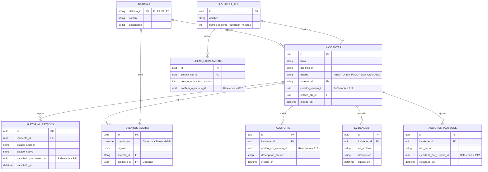

# Proyecto 11 
Monorepo con:
- Frontend: Next.js + TypeScript
- Backend: NestJS + TypeScript
- Base de datos: PostgreSQL
- Cache: Redis
- ORM: TypeORM
- Contenedores: Docker Compose

## Estructura

```txt
apps/
  frontend/
  backend/
docker-compose.yml
package.json
```

## Requisitos

- Node.js 20+
- npm 10+
- Docker Desktop

## Configuracion inicial

1. Instala dependencias del monorepo:

```bash
npm install
```

3. Levanta servicios de infraestructura:

```bash
docker compose up -d
```

## Desarrollo

Ejecuta backend y frontend en dos terminales:

```bash
npm run dev:backend
```

```bash
npm run dev:frontend
```

- Frontend: http://localhost:3000
- API Health: http://localhost:3001/api/health

## Build

```bash
npm run build
```

## Diagrama Entidad-Relación (Base de Datos)


