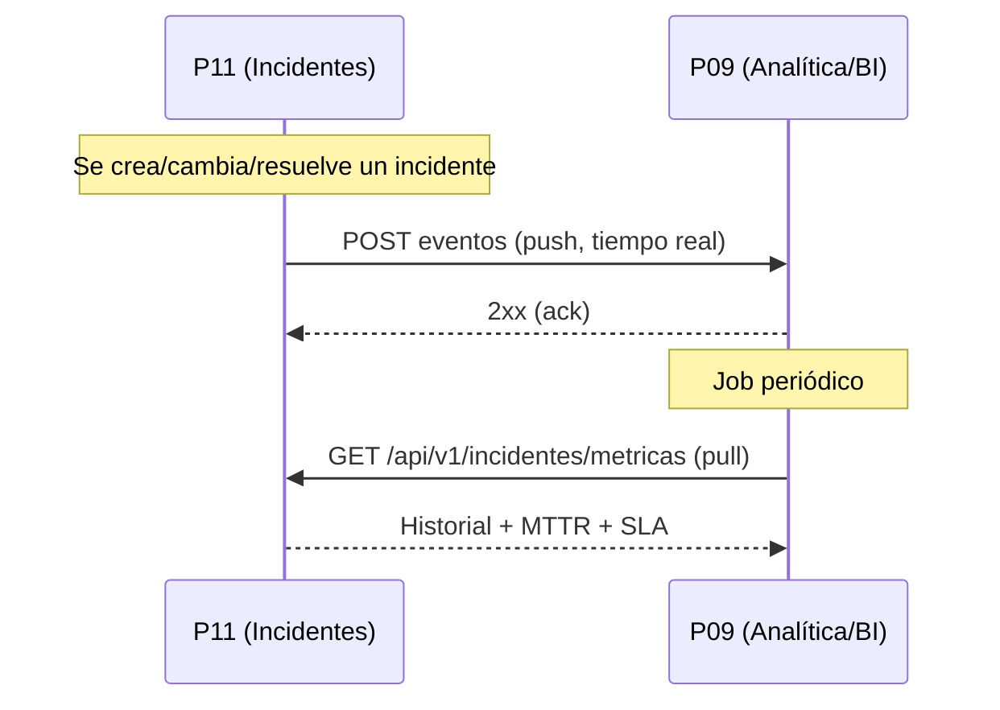

# Guía de Integración: P11 (Incidentes) ↔ P09 (Analítica y BI)

Esta guía describe cómo se conecta nuestra plataforma de Gestión de Incidentes (**P11 – MochiCode**)
con el equipo de **Analítica y BI (P09)**. Cubre **qué hace P11 automáticamente** y **qué debe implementar P09** en su lado.

Existen **dos flujos** de integración (son complementarios, pueden usarse ambos):

| Flujo | Dirección | Iniciador | Propósito |
|-------|-----------|-----------|-----------|
| **1. Push de eventos** | P11 → P09 | P11 (automático) | P11 empuja el ciclo de vida de cada incidente a P09 en tiempo real |
| **2. Pull de métricas** | P09 → P11 | P09 (programado) | P09 consulta periódicamente métricas históricas (MTTR, SLA) |

---

## 🔵 Flujo 1: Push de eventos (P11 → P09)

Cada vez que un incidente **se crea**, **cambia de estado** o **se resuelve**, P11 envía
automáticamente un evento HTTP a P09. Esto ocurre **fuera de la transacción** de base de datos:
si P09 no responde, el incidente **igual se guarda** en P11 (el fallo solo se registra en auditoría).

### Lo que hace P11 (ya implementado)

- Servicio: `IncidentesNotificationService.notificarEventoAP9()`.
- Se dispara desde `IncidentesService` en `incident_created`, `incident_status_changed` e `incident_resolved`.
- Envía un `POST` al endpoint configurado en la variable de entorno **`P9_ANALITICA_URL`**.
- Traduce nuestros valores internos al vocabulario de P09:
  - Prioridad: `CRITICA→critical`, `ALTA→high`, `MEDIA→medium`, `BAJA→low`.
  - Estado: `ABIERTO/VENCIDO→open`, `EN_PROGRESO→investigating`, `CERRADO→resolved`.
  - En cierre calcula `resolution_time_hours` (MTTR) y `sla_met`.

### Lo que debe hacer P09

**Exponer un endpoint HTTP que reciba eventos vía POST.**

- **Método:** `POST`
- **URL:** la que P09 nos indique (nosotros la configuramos en `P9_ANALITICA_URL`).
  Endpoint actual acordado: **`https://analisis-proyecto-ti.onrender.com/v1/events`**.
- **Content-Type:** `application/json`
- **Respuesta esperada:** `2xx` (idealmente `200` o `202`). Cualquier `2xx` se considera éxito.

#### Estructura del payload que P09 recibirá (envelope)

```json
{
  "source": "incidents",
  "event_type": "incident_created",
  "payload": {
    "incident_id": "uuid-del-incidente",
    "title": "Caída masiva pasarela de pagos",
    "severity": "critical",
    "status": "open",
    "opened_at": "2026-07-09T15:30:00.000Z"
  }
}
```

**Campos del envelope:**

| Campo | Tipo | Descripción |
|-------|------|-------------|
| `source` | string | Siempre `"incidents"` |
| `event_type` | enum | `incident_created` \| `incident_status_changed` \| `incident_resolved` |
| `payload` | objeto | Detalle del incidente (ver abajo) |

**Campos del `payload`:**

| Campo | Tipo | Presente en | Descripción |
|-------|------|-------------|-------------|
| `incident_id` | string (UUID) | siempre | Identificador único del incidente en P11 |
| `title` | string | created / status_changed | Título del incidente |
| `severity` | enum | siempre | `critical` \| `high` \| `medium` \| `low` |
| `status` | enum | siempre | `open` \| `investigating` \| `resolved` |
| `opened_at` | string (ISO 8601) | created | Fecha de apertura |
| `resolved_at` | string (ISO 8601) | resolved | Fecha de resolución |
| `resolution_time_hours` | number | resolved | MTTR en horas (2 decimales) |
| `sla_met` | boolean | resolved | `true` si se resolvió dentro del SLA |

#### Ejemplo de evento de resolución (`incident_resolved`)

```json
{
  "source": "incidents",
  "event_type": "incident_resolved",
  "payload": {
    "incident_id": "uuid-del-incidente",
    "severity": "critical",
    "status": "resolved",
    "resolved_at": "2026-07-09T18:05:00.000Z",
    "resolution_time_hours": 2.58,
    "sla_met": true
  }
}
```

> **Recomendación para P09:** usar `incident_id` como clave idempotente (upsert). Un mismo
> incidente puede llegar varias veces (creación → cambio de estado → resolución).

---

## 🟢 Flujo 2: Pull de métricas (P09 → P11)

P09 puede consultar periódicamente el historial y métricas agregadas de incidentes.

### Lo que hace P11 (expone el endpoint)

- **Método:** `GET`
- **Endpoint:** `GET /api/v1/incidentes/metricas`
- **Devuelve:** historial de incidentes, SLAs cumplidos y tiempos medios de resolución (MTTR).

### Lo que debe hacer P09

- Programar un job periódico (ej. cron cada X minutos/horas) que haga `GET` a ese endpoint.
- Autenticarse según el esquema del proyecto (JWT de **P12** o `x-api-key`, ver sección Seguridad).
- Ingerir y almacenar la respuesta en su motor analítico / BI.

---

## 🔐 Seguridad y autenticación

- P11 valida las peticiones entrantes con `HybridAuthGuard` (acepta **JWT de P12** o **`x-api-key`**).
- Para el **pull de métricas**, P09 debe enviar sus credenciales en cada request:
  - Header `Authorization: Bearer <token-JWT>` (emitido por P12), **o**
  - Header `x-api-key: <clave>` acordada con nuestro equipo.
- Para el **push de eventos**, P09 nos indica si su endpoint requiere autenticación
  (header/token) para que lo configuremos de nuestro lado.

---

## ⚙️ Checklist de configuración conjunta

**P09 debe entregarnos:**
- [ ] URL pública de su endpoint receptor de eventos (para setear `P9_ANALITICA_URL`).
- [ ] Requisitos de autenticación de ese endpoint (si aplica).
- [ ] Confirmación de que responde `2xx` ante un POST válido.

**P11 debe entregar a P09:**
- [ ] URL base de nuestra API y el endpoint `GET /api/v1/incidentes/metricas`.
- [ ] Credenciales de acceso (JWT vía P12 o `x-api-key`).
- [ ] Este documento con el contrato de payloads.

---

## 📊 Resumen del flujo de datos


